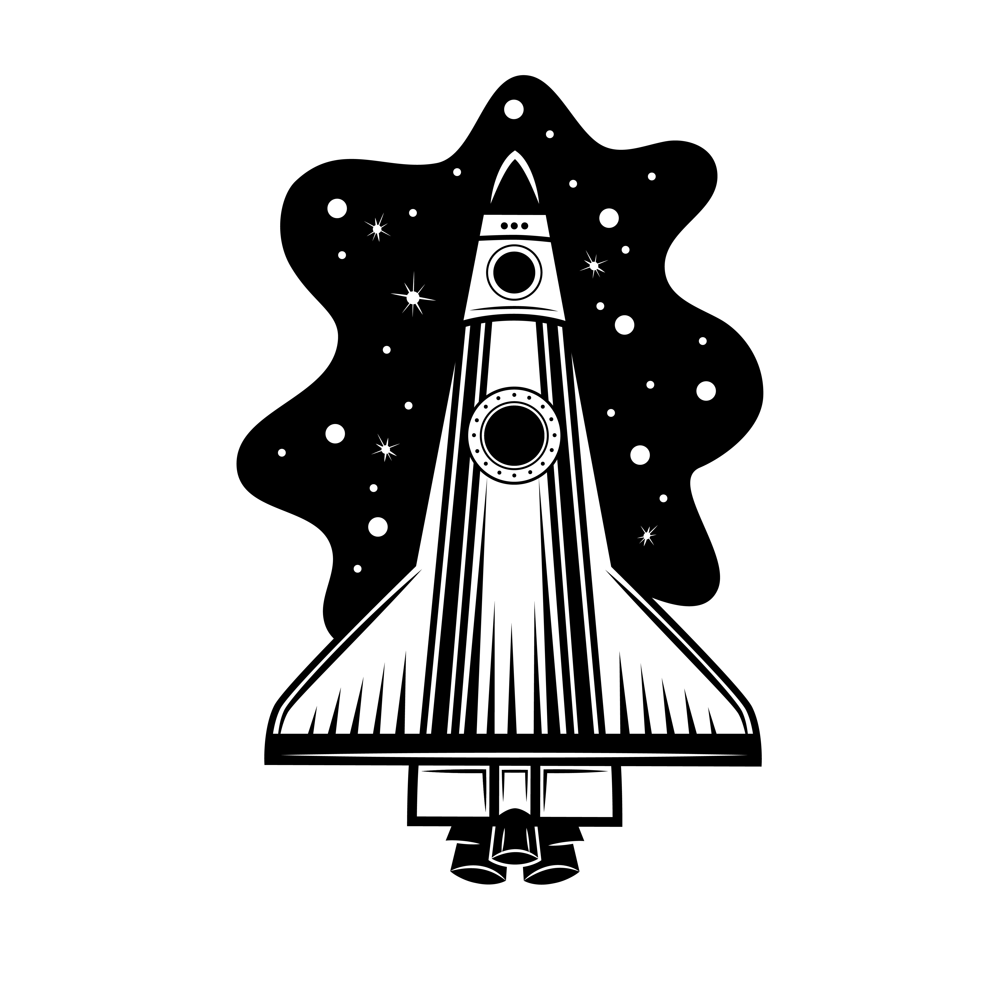

<h2>Hi, I'm Humberto Daniel</h2>

### 👨🏻‍💻 &nbsp;About Me

I learnt to programme when I was 12; I’m passionate about everything to do with electronics and aerospace. I also love developing video games, taking part in game jams and creating web applications.

### 🛠 &nbsp;Skills

